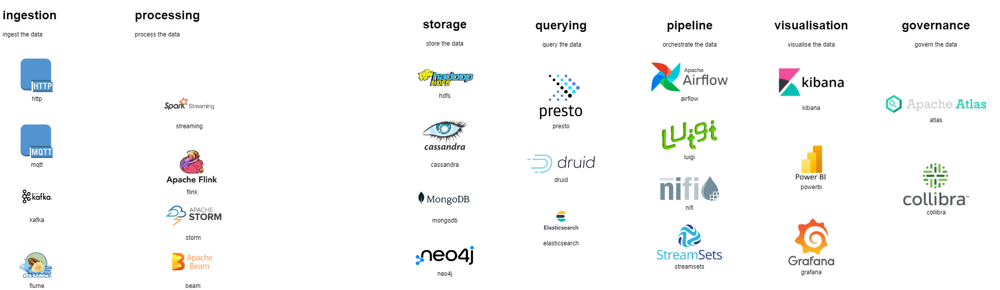

# pp_real_time_system

# Design

# ingestion

identify and connect to the data sources that produce the data you want to analyze. These can be various types of sensors, devices, applications, web services, or APIs that generate data continuously or periodically.

# processing
Process the data as it flows through your system, using a stream processing framework or tool. Stream processing allows you to perform various operations on the data, such as aggregation, enrichment, joining, windowing, or pattern matching, without storing the data in a database or a file system. Stream processing can also handle complex event processing, which involves detecting and responding to events or conditions that occur within the data stream.

# storage
store the data or the results of the stream processing in a suitable data storage system, depending on your use case and requirements. You may want to store the raw data, the processed data, or both, for later analysis or backup purposes. You may also want to store the data in different formats or structures, such as files, tables, documents, or graphs. 

# querying
 query the data or the results of the stream processing using a query engine or tool that supports real-time or near real-time queries. Querying the data allows you to explore, visualize, and analyze the data in various ways, such as dashboards, reports, charts, or alerts. You can also use queries to perform advanced analytics, such as machine learning, anomaly detection, or sentiment analysis.

# pipeline
orchestrate and manage the data pipeline that connects the different stages of the data analysis process. A data pipeline is a set of components and tasks that move and transform the data from the source to the destination, according to a predefined logic and schedule. A data pipeline can also handle errors, failures, retries, and dependencies, and provide monitoring and logging capabilities.

# visualisation
visualise the data

# governance
govern the data